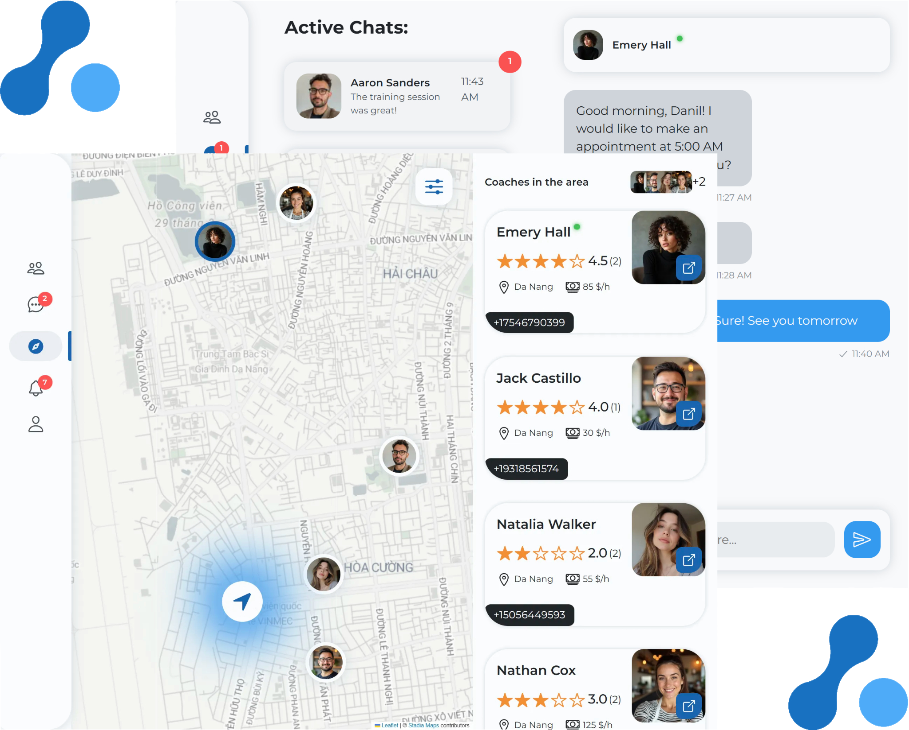

# FitNet: Connect, Reserve, Work out! ([View Live](https://fitnet.app))



## Table of Contents

- [Overview](#overview)
  - [What is FitNet?](#what-is-fitnet)
  - [Features](#features)
  - [Technology Stack](#technology-stack)
- [Development Process](#development-process)
  - [Purpose and Goals](#purpose-and-goals)
  - [Encountered Challenges](#encountered-challenges)
  - [What I Learned](#what-i-learned)
- [Author](#author)
- [License](#license)

## Overview

### What is FitNet?

FitNet is a **modern fitness networking platform designed to bridge the gap between coaches and clients**. Whether you're a fitness coach looking to expand your client base or someone searching for the perfect trainer, FitNet's interactive map interface makes location-based discovery effortless. With built-in chat, connection requests, and a rating system, the entire process from discovery to communication happens within one seamless platform.

FitNet is a **full-stack social media web application built with TypeScript, Next.js, and Supabase database**, featuring server-side rendering, real-time WebSocket subscriptions, and secure authentication via Auth.js with OAuth and credentials support. The frontend employs React-Leaflet for map visualization and React Hook Form with Zod for type-safe form validation. The web application incorporates modern and responsive UI with startup/upbeat design personality adapted to mobile, tablet and desktop screens by utilizing SCSS Modules for granular component-first styling.

### Features

- **🗺️ Interactive Map Search** - A location-based discovery system built with React-Leaflet and Stadia Maps API allowing users to find coaches or clients within a customizable radius, with filtering by expertise, fitness goals, age, and gender.
- **💬 Real-time Messaging** - Built-in chat functionality powered by Supabase Realtime enabling instant communication between users, with read receipts, online status indicators, and message history.
- **🔐 Secure Authentication & Authorization** - Multi-provider authentication system supporting both Google OAuth and email/password credentials using Auth.js with JWT strategy, featuring protected routes and authorization via Next.js middleware.
- **⭐ Rating System** - Rating and review functionality, allowing clients to share their experiences and help others make informed decisions.
- **🔔 Notifications System** - Real-time notification system for connection requests, new messages, and reviews, with filtering and read/unread status tracking.

### Technology Stack


## Development Process

### Purpose and Goals

My motivation for building this project stemmed from recognizing the challenge fitness coaches face in finding clients and the difficulty clients experience in discovering qualified, local trainers. I wanted to create a platform that eliminates these pain points by providing a location-based search system with built-in communication tools.

1. **🤝 Facilitate Connections**

   - Help clients discover qualified coaches based on location, expertise, and reviews
   - Enable coaches to find clients actively searching for fitness guidance
   - Provide an intuitive connection request and approval workflow

2. **💼 Streamline Communication**

   - Integrate real-time messaging to eliminate the need for external communication tools
   - Implement notification system to keep users informed of important events
   - Enable transparency through reviews and ratings

3. **⚡ Optimize Discovery**

   - Build an interactive map interface for visual location-based search
   - Implement comprehensive filtering to help users find their ideal match
   - Display real-time online status and availability indicators

My goal was to learn how to **build a full-stack application with real-time WebSocket subscriptions** and **secure authentication/authorization flows**.

### Encountered Challenges

The biggest challenge I faced was **implementing real-time features using Supabase's Realtime subscriptions** while maintaining optimal performance and state synchronization across the application.

**I had to carefully manage multiple real-time channels** for different features (messages, notifications, presence tracking) without creating memory leaks or causing unnecessary re-renders. Here's how I handled the message synchronization:

```typescript
useEffect(() => {
  const channelMsgs = supabaseClient
    .channel(`realtime:messages:msgs:${session.user.id}`)
    .on(
      "postgres_changes",
      { event: "INSERT", schema: "public", table: "messages" },
      (payload) => {
        const newMessage = payload.new;
        if (
          newMessage.sender_id === session.user.id ||
          newMessage.receiver_id === session.user.id
        ) {
          // Fetch and update message list
        }
      },
    )
    .subscribe();

  return () => {
    channelMsgs.unsubscribe();
  };
}, [session.user.id]);
```

Another challenge was **implementing optimistic UI updates to improve perceived performance**. Using React's `useOptimistic` hook, I had to ensure that UI changes appeared instantly while handling potential rollbacks if server operations failed:

```typescript
const [optimisticMessages, setOptimisticMessages] = useOptimistic(
  messages,
  (state, newMessage) => [...state, newMessage],
);

async function handleSendMessage(content: string) {
  const tempMessage = {
    id: crypto.randomUUID(),
    content,
    sender_id: session.user.id,
    created_at: new Date().toISOString(),
  };

  startTransition(() => {
    setOptimisticMessages(tempMessage);
  });

  await sendMessage(tempMessage);
}
```

### What I Learned

I deepened my expertise in full-stack development by learning **how to integrate WebSocket subscriptions**, **implement JWT authentication along with Next.js middleware authorization**, and **design efficient Supabase database schemas** with proper foreign key relationships and Row Level Security policies. The project also taught me to **integrate third-party APIs like Stadia Maps for geolocation features** and **use React's useOptimistic hook for instant UI feedback**.

## Author

Designed and built by **Danil Dikhtyar** - Front-end developer creating modern websites / web applications.

**Connect with me:**

- 🌐 Portfolio: [dikhtyar.dev](https://dikhtyar.dev)
- 📫 Email: [contact@dikhtyar.dev](mailto:contact@dikhtyar.dev)
- 🐦 Twitter: [@Rock_n_Roll_CRC](https://x.com/Rock_n_Roll_CRC)

_Feel free to reach out for collaborations or questions about this project!_

## License

Copyright (c) 2025 Danil Dikhtyar. All rights reserved.

Licensed under the MIT License as stated in the [LICENSE](LICENSE):

```text
Copyright (c) 2025 Danil Dikhtyar

Permission is hereby granted, free of charge, to any person obtaining a copy
of this software and associated documentation files (the "Software"), to deal
in the Software without restriction, including without limitation the rights
to use, copy, modify, merge, publish, distribute, sublicense, and/or sell
copies of the Software, and to permit persons to whom the Software is
furnished to do so, subject to the following conditions:

The above copyright notice and this permission notice shall be included in all
copies or substantial portions of the Software.

THE SOFTWARE IS PROVIDED "AS IS", WITHOUT WARRANTY OF ANY KIND, EXPRESS OR
IMPLIED, INCLUDING BUT NOT LIMITED TO THE WARRANTIES OF MERCHANTABILITY,
FITNESS FOR A PARTICULAR PURPOSE AND NONINFRINGEMENT. IN NO EVENT SHALL THE
AUTHORS OR COPYRIGHT HOLDERS BE LIABLE FOR ANY CLAIM, DAMAGES OR OTHER
LIABILITY, WHETHER IN AN ACTION OF CONTRACT, TORT OR OTHERWISE, ARISING FROM,
OUT OF OR IN CONNECTION WITH THE SOFTWARE OR THE USE OR OTHER DEALINGS IN THE
SOFTWARE.
```
